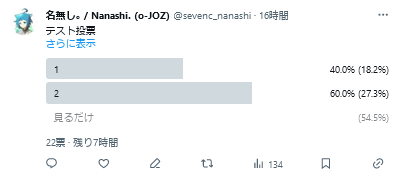

# I need real vote / 投票結果から「閲覧用」を無くした割合を表示する拡張機能

「I need real vote」は、投票機能のあるサイトで、投票結果から「閲覧用」を無くした割合を表示する拡張機能です。

## 対応サイト

- Twitter（新X）\
  
- YouTube\
  

## 使い方

1. [Tampermonkey](https://www.tampermonkey.net/)、または [Userscripts](https://itunes.apple.com/us/app/userscripts/id1463298887) をインストールします。
2. ユーザースクリプトをインストールします。

### Tampermonkey

```
https://raw.githubusercontent.com/sevenc-nanashi/i-need-real-vote/release/i-need-real-vote.user.js
```

を開く、または`ダッシュボード` > `ユーティリティ` > `URLからインポート` に上記のURLを入力してインストールします。

### Userscripts

上のURLを開き、`あぁ`ボタンの`</> Userscripts`をタップ/クリックします。\
その後、`Userscript detected. Click (Tap) to Install.`をタップ/クリックします。

## 開発

### 必要なもの

- [pnpm](https://pnpm.io/)
- [Node.js](https://nodejs.org/)（v18）

```
# 監視ビルド
pnpm dev

# zipをビルド
pnpm build

# ESLint
pnpm lint
```

## ライセンス

この拡張機能はMITライセンスのもとで公開されています。詳細は[LICENSE](LICENSE)を参照してください。
